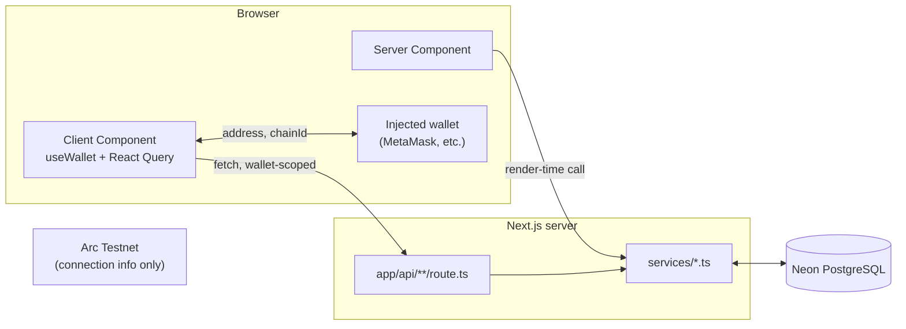
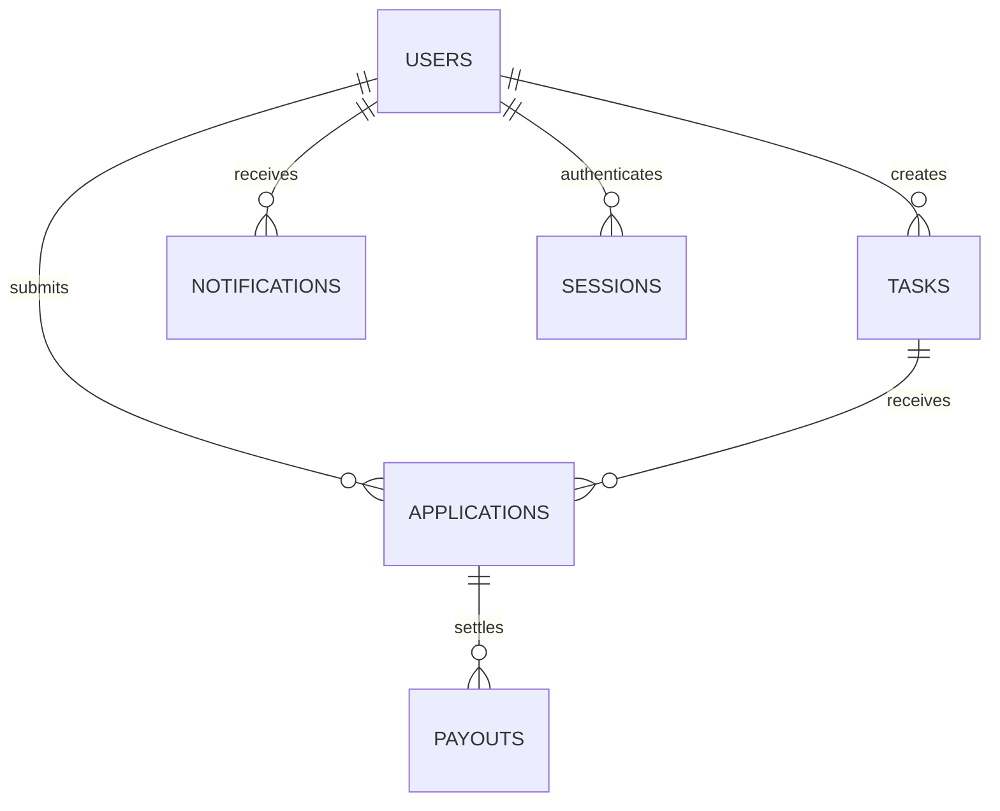
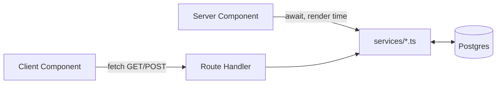

# Architecture

This document describes **how Nano Task Marketplace is built today**, as of the end of Phase 5. For *why* it was built this way, see [DECISIONS.md](./DECISIONS.md). For what's deferred, see [TECHNICAL_DEBT.md](./TECHNICAL_DEBT.md). For where this is headed, see [ROADMAP.md](./ROADMAP.md).

## Contents

- [Overall system architecture](#overall-system-architecture)
- [Frontend architecture](#frontend-architecture)
- [Backend architecture](#backend-architecture)
- [Database architecture](#database-architecture)
- [API architecture](#api-architecture)
- [Wallet integration](#wallet-integration)
- [React Query architecture](#react-query-architecture)
- [Drizzle ORM](#drizzle-orm)
- [Neon PostgreSQL](#neon-postgresql)
- [Folder organization](#folder-organization)
- [Data flow](#data-flow)
- [Current authentication approach](#current-authentication-approach)
- [Planned SIWE authentication](#planned-siwe-authentication)
- [Design principles](#design-principles)
- [Scalability considerations](#scalability-considerations)

---

## Overall system architecture

Nano Task Marketplace is a single Next.js application — there is no separate backend service. Three systems are in play, and it's worth being precise about the boundary between them:

1. **The Next.js app itself** — renders pages, serves API routes, and is the only thing that talks to the database.
2. **Neon PostgreSQL** — the single source of truth for tasks, applications, payouts, notifications, and users. Reached exclusively through Drizzle, exclusively from `services/*` code.
3. **Arc Testnet (the blockchain)** — reached only for wallet *connection* (address, chain ID, network switching) via wagmi/viem. **No application data — tasks, applications, payouts, notifications — is currently read from or written to the chain.** Payouts are Postgres rows with a `tx_hash` column that nothing populates yet; there is no on-chain settlement wired up. This is a common point of confusion worth stating plainly.



## Frontend architecture

Two kinds of components carry the application's data needs:

- **Server Components** render global, non-personal data directly, by calling a `services/*` function at render time. This covers the marketplace task list, task details, and (still on mock data) the Dashboard Overview page.
- **Client Components**, specifically a small family of "Container" components introduced during Phase 5 (`MyTasksContainer`, `NotificationsContainer`, `EarningsContainer`, `ProfileStatsContainer`, `SettingsContainer`), own every wallet-scoped data need. Each reads the connected address via `useWallet()`, fetches through React Query against an API route, and renders a connect-prompt, loading, error, or real-data state.

Presentational components (`TaskCard`, `PayoutHistory`, `NotificationItem`, `ProfileStats`, `SettingsRow`, and so on) are pure and prop-driven throughout, and were never redesigned during the Phase 5 migration — only the data feeding them changed. `ProfileCard`, `WalletInfo`, and `WalletSettingsSection` were already self-sufficient Client Components (reading `useWallet()` directly) before Phase 5 began and needed no changes at all.

## Backend architecture

There is no standalone backend process. "Backend" here means:

- **Route Handlers** under `app/api/*` — the only place a Client Component can reach the database, and the only write path in the application (`POST /api/applications`).
- **Services** under `services/*` — the only code that imports the Drizzle client. Every route composes one or more service functions; no route talks to the database directly, and no component imports a service directly for wallet-scoped data (only Server Components do, and only for global data).

## Database architecture

Six tables, defined once in `db/schema.ts`:

| Table | Purpose | Key relationships |
|---|---|---|
| `users` | One row per wallet address that has taken an action in the app | Referenced by tasks (as creator), applications, payouts (transitively), notifications, sessions |
| `tasks` | The marketplace catalog | `creator_id → users.id` |
| `applications` | A wallet's application to a task | `task_id → tasks.id`, `applicant_id → users.id`; unique on `(task_id, applicant_id)` |
| `payouts` | A payout tied to an application | `application_id → applications.id` |
| `notifications` | In-app notifications for a user | `user_id → users.id` |
| `sessions` | Reserved for wallet authentication | `user_id → users.id` — **defined, currently unused** |



Every table has a UUID primary key. Beyond primary keys, only two indexes exist: `users.wallet_address` (unique — the identity guarantee everything else depends on) and `applications (task_id, applicant_id)` (unique — the mechanism duplicate-application prevention relies on). No other secondary indexes exist yet; see [TECHNICAL_DEBT.md](./TECHNICAL_DEBT.md).

Summary figures (earnings totals, profile task counts) are **never stored**. They are computed at read time with SQL aggregation (`SUM`/`COUNT … FILTER (WHERE …)`) directly against `payouts` and `applications`, so they can never drift out of sync with the rows they summarize.

## API architecture

Five Route Handlers, all under `app/api/`, all JSON over HTTP:

| Route | Methods |
|---|---|
| `/api/applications` | `GET`, `POST` |
| `/api/notifications` | `GET` |
| `/api/earnings` | `GET` |
| `/api/profile` | `GET` |
| `/api/settings` | `GET` |

Every `GET` route follows the same contract: a `?wallet=0x…` query parameter, validated by format, resolved to a `users` row if one exists (never auto-created on a read), and either real data or a well-formed empty/zero default if the wallet has no user row yet. Only `POST /api/applications` auto-creates a user, since applying is the one action that legitimately originates a new identity. Responses are wrapped in a small object keyed by resource name (`{ tasks }`, `{ notifications }`, `{ summary, payouts }`, `{ stats, totalEarningsUsdc }`, `{ sections }`).

## Wallet integration

Wallet connectivity runs through **wagmi's `injected()` connector** and **viem**, configured in `providers/WagmiProvider.tsx` against the Arc Testnet chain definition in `lib/arc/chains.ts`. `hooks/useWallet.ts` is the single hook every component uses for connection state (`address`, `isConnected`, `chainId`, `chainName`, `isCorrectNetwork`) and actions (`connect`, `disconnect`, `switchToArc`).

Circle App Kit (`@circle-fin/app-kit`) is installed and listed as the intended primary payment SDK, but is **not currently wired into the connection flow** — the app connects wallets through wagmi directly. Circle's developer-controlled and user-controlled wallet packages are also installed and reserved for the payout work described in the [Roadmap](./ROADMAP.md), but nothing in the current codebase calls them yet.

## React Query architecture

`providers/QueryProvider.tsx` defines a single `QueryClient` (a module-level singleton per browser tab) with a 60-second `staleTime`, predating Phase 5. Every wallet-scoped Container follows the same pattern:

```ts
useQuery({
  queryKey: ["<feature>", address],
  queryFn: () => fetch(`/api/<feature>?wallet=${address}`),
  enabled: isConnected && Boolean(address),
});
```

The `[feature, address]` key means switching connected wallets naturally invalidates and refetches. `enabled` is the universal gate that keeps every query from firing while disconnected — this is also how "do not query the database while disconnected" is enforced at the client, in addition to each route's own server-side validation.

## Drizzle ORM

`drizzle-orm/neon-serverless`, paired with `@neondatabase/serverless`'s `Pool` — not the simpler HTTP-only `neon-http` driver — specifically to keep multi-statement transaction support available (needed once application-approval-plus-payout-creation becomes atomic, in a future phase). `db/schema.ts` is the single source of truth every service imports table definitions from; `db/index.ts` exports one client singleton; migrations are generated with `drizzle-kit generate` and applied with `drizzle-kit migrate`.

## Neon PostgreSQL

A single serverless Postgres instance on one branch — there is no preview-branch-per-deploy workflow configured yet. Reached exclusively through the WebSocket-capable `Pool`, never Neon's plain HTTP driver, to preserve transaction support.

## Folder organization

```
app/            Routes (pages + api/ route handlers)
components/     Presentational + Client "Container" components, grouped by feature
services/       All database access — the only place `db` is imported for queries
db/             Schema, client, migrations, seed script
hooks/          useWallet.ts
providers/      App-wide context providers (Query, Wagmi, Circle)
lib/            Small stateless utilities (chain config, formatting)
types/          Shared TypeScript contracts between services and components
```

`services/<domain>/mock*.ts` filenames were deliberately **kept** through the Phase 5 migration even after their contents stopped being mock data — see [DECISIONS.md#adr-009](./DECISIONS.md#adr-009-database-backed-services-replaced-mocks-incrementally-keeping-file-paths-stable) for why, and [TECHNICAL_DEBT.md](./TECHNICAL_DEBT.md) for the cosmetic rename this leaves on the backlog.

## Data flow

Two distinct paths, depending on whether data is global or wallet-scoped:

**Reads of global data** (the marketplace catalog): a Server Component calls a service function directly at render time. No network hop — it's a function call inside the same server process.

**Reads and writes of wallet-scoped data**: a Client Component reads the connected address, calls a Route Handler over `fetch()`, which calls the same service function a Server Component would have called. The service layer is the single place database access happens, regardless of which side of the client/server boundary the request originated on.



## Current authentication approach

There isn't one. A wallet address reported by the connected provider is treated as sufficient to attribute both reads and writes to that address — it is sent as a plain query parameter or JSON field, with no signature ever requested. See [PROJECT_STATUS.md](./PROJECT_STATUS.md#current-security-status) for the direct implication of this.

## Planned SIWE authentication

The `sessions` table already exists for this. The intended flow: the client requests a nonce, signs a Sign-In-With-Ethereum message with wagmi's `useSignMessage`, the server verifies it with viem's `verifyMessage`/`recoverMessageAddress` (both already installed, no new dependency required), and issues a session cookie. Once that exists, wallet-scoped Server Components become possible again by reading the session instead of trusting a client-supplied address — see [ROADMAP.md](./ROADMAP.md#current-phase).

## Design principles

- **Keep the file path, swap the internals.** Every mock service migration kept its original export names and file location, so no importing component ever had to change.
- **Narrowest possible Client Component islands.** Only the piece of a page that genuinely needs wallet state or interactivity is a Client Component; everything else stays a Server Component.
- **Compute aggregates in SQL, not JavaScript.** Summary numbers are `SUM`/`COUNT` queries against Postgres, never fetch-all-rows-and-reduce.
- **The service layer is the only door to the database.** No component and no route queries Drizzle directly.
- **Never redesign a component to migrate its data source.** Every Phase 5 migration proved this was possible because the mock services already returned display-ready shapes matching the real type contracts.

## Scalability considerations

The current design is appropriate for low-volume, demonstration-scale usage and has real, known limits before it would hold up under real traffic:

- No secondary indexes on the foreign-key columns used in every wallet-scoped join (`applications.applicant_id`, `payouts.application_id`, `notifications.user_id`) — invisible today, a real latency risk at scale.
- No pagination anywhere — task list, payout history, notifications, and My Tasks all return their full result set.
- No HTTP caching layer in front of the API routes (correct for now, since every response is wallet-specific, but worth revisiting once sessions exist).
- React Query's cache is per-browser-tab only; there is no shared or server-side cache.
- A single Neon branch, with no read-replica or connection-pooling strategy beyond what the `Pool` driver provides by default.

See [TECHNICAL_DEBT.md](./TECHNICAL_DEBT.md) for the full backlog these points feed into.
