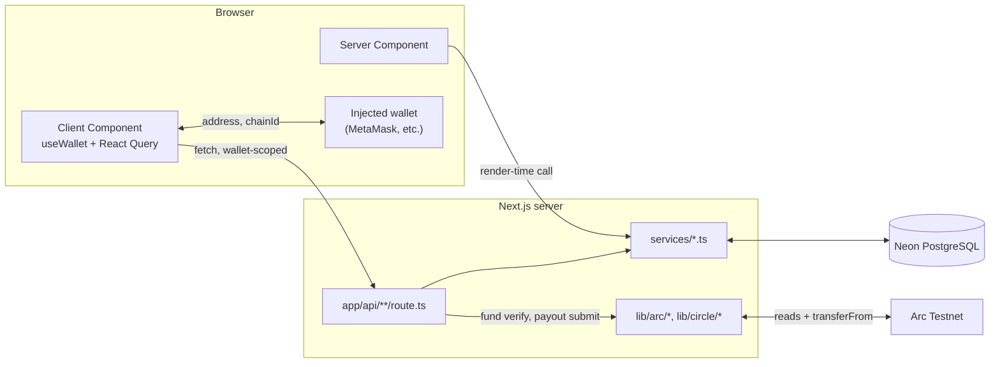
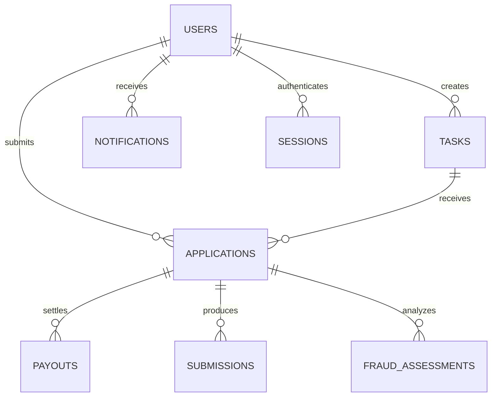
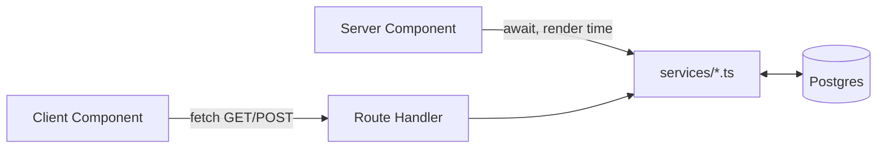

# Architecture

This document describes **how Nano Task Marketplace is built today**. For *why* it was built this way, see [DECISIONS.md](./DECISIONS.md). For what's deferred, see [TECHNICAL_DEBT.md](./TECHNICAL_DEBT.md). For where this is headed, see [ROADMAP.md](./ROADMAP.md).

## Contents

- [Overall system architecture](#overall-system-architecture)
- [Frontend architecture](#frontend-architecture)
- [Backend architecture](#backend-architecture)
- [Database architecture](#database-architecture)
- [API architecture](#api-architecture)
- [Wallet integration](#wallet-integration)
- [React Query architecture](#react-query-architecture)
- [Drizzle ORM](#drizzle-orm)
- [Neon PostgreSQL](#neon-postgresql)
- [Folder organization](#folder-organization)
- [Data flow](#data-flow)
- [Current authentication approach](#current-authentication-approach)
- [Design principles](#design-principles)
- [Scalability considerations](#scalability-considerations)

---

## Overall system architecture

Nano Task Marketplace is a single Next.js application — there is no separate backend service. Three systems are in play, and it's worth being precise about the boundary between them:

1. **The Next.js app itself** — renders pages, serves API routes, and is the only thing that talks to the database.
2. **Neon PostgreSQL** — the single source of truth for tasks, applications, payouts, notifications, and users. Reached exclusively through Drizzle, exclusively from `services/*` code.
3. **Arc Testnet (the blockchain)** — reached from two distinct places, worth being precise about since they're easy to conflate. *Client-side*, via wagmi/viem, only for wallet **connection** (address, chain ID, network switching) — the browser never submits a transaction directly. *Server-side*, exclusively through `lib/arc/*` (and, for the optional Circle-managed payout path, `lib/circle/*`): funding a task is verified by reading the creator's real on-chain `approve()` transaction (`lib/arc/verifyApproval.ts`), and releasing a payout submits a real `transferFrom` (`lib/arc/payoutRelay.ts`), signed either by a raw executor key or, when `PAYOUT_CUSTODY_MODE=circle`, by Circle's managed infrastructure. Every submission is independently re-verified against Arc's own RPC receipt (`lib/arc/verifyPayout.ts`) before being trusted — a successful submission alone is never treated as proof a payout or funding action actually succeeded. `payouts.tx_hash` is populated with this real, verified hash once a payout completes.



## Frontend architecture

Two kinds of components carry the application's data needs:

- **Server Components** render global, non-personal data directly, by calling a `services/*` function at render time. This covers the marketplace task list, task details, and (still on mock data) the Dashboard Overview page.
- **Client Components**, specifically a family of "Container" components, own every wallet-scoped data need: five introduced during Phase 5 (`MyTasksContainer`, `NotificationsContainer`, `EarningsContainer`, `ProfileStatsContainer`, `SettingsContainer`), plus `ApplicantsContainer` (Phase 7, a task creator's view of a task's applicants). Each reads the connected address via `useWallet()`, fetches through React Query against an API route, and renders a connect-prompt, loading, error, or real-data state.

Presentational components (`TaskCard`, `PayoutHistory`, `NotificationItem`, `ProfileStats`, `SettingsRow`, and so on) are pure and prop-driven throughout, and were never redesigned during the Phase 5 migration — only the data feeding them changed. `ProfileCard`, `WalletInfo`, and `WalletSettingsSection` were already self-sufficient Client Components (reading `useWallet()` directly) before Phase 5 began and needed no changes at all.

## Backend architecture

There is no standalone backend process. "Backend" here means:

- **Route Handlers** under `app/api/*` — the only place a Client Component can reach the database. `POST /api/applications` is no longer the only write path: authentication, task funding/cancellation, the full applicant lifecycle (approve, reject, revoke-approval, payout, submission, evaluation, fraud analysis), and AI task generation are all separate write routes today — see [API architecture](#api-architecture) for the full grouping.
- **Services** under `services/*` — the only code that imports the Drizzle client. Every route composes one or more service functions; no route talks to the database directly, and no component imports a service directly for wallet-scoped data (only Server Components do, and only for global data).

## Database architecture

Eight tables, defined once in `db/schema.ts`:

| Table | Purpose | Key relationships |
|---|---|---|
| `users` | One row per wallet address that has taken an action in the app | Referenced by tasks (as creator), applications, payouts (transitively), notifications, sessions |
| `tasks` | The marketplace catalog | `creator_id → users.id` |
| `applications` | A wallet's application to a task | `task_id → tasks.id`, `applicant_id → users.id`; unique on `(task_id, applicant_id)` |
| `payouts` | A payout tied to an application | `application_id → applications.id`; unique on `application_id` |
| `submissions` | A worker's submitted work for an approved application, plus its AI evaluation verdict/feedback | `application_id → applications.id`; unique on `application_id` |
| `fraud_assessments` | An advisory fraud-risk analysis run against an application's submission | `application_id → applications.id`; deliberately **not** unique — a creator can re-run analysis and each run is preserved rather than overwritten |
| `notifications` | In-app notifications for a user | `user_id → users.id` |
| `sessions` | The authenticated-session source of truth — one row per SIWE sign-in, promoted from pending (nonce issued) to active (signature verified) | `user_id → users.id` |



Every table has a UUID primary key (`sessions.id` is text). Beyond primary keys, the current indexes are: `users.wallet_address` (unique — the identity guarantee everything else depends on), `applications (task_id, applicant_id)` (unique — the mechanism duplicate-application prevention relies on), `applications.applicant_id`, `tasks.creator_id`, `payouts.application_id` (unique — enforces one payout per application), `submissions.application_id` (unique — enforces one submission per application), `fraud_assessments.application_id` (not unique, matching that table's own one-to-many design), and `sessions.nonce`. See [TECHNICAL_DEBT.md](./TECHNICAL_DEBT.md) for anything still outstanding.

Summary figures (earnings totals, profile task counts) are **never stored**. They are computed at read time with SQL aggregation (`SUM`/`COUNT … FILTER (WHERE …)`) directly against `payouts` and `applications`, so they can never drift out of sync with the rows they summarize.

## API architecture

Route Handlers live under `app/api/`, all JSON over HTTP, grouped by resource rather than enumerated with a fixed count (the exact route count keeps changing as the applicant lifecycle grows — most recently with `revoke-approval`):

| Resource | Routes |
|---|---|
| Auth | `POST /api/auth/nonce`, `POST /api/auth/verify`, `GET /api/auth/session`, `POST /api/auth/logout` |
| Tasks | `POST /api/tasks`, `GET /api/tasks/posted`, `POST /api/tasks/[taskId]/fund`, `POST /api/tasks/[taskId]/cancel` |
| Applications | `GET`/`POST /api/applications`, `GET /api/tasks/[taskId]/applicants` |
| Applicant lifecycle | `POST /api/tasks/[taskId]/applicants/[applicationId]/{approve, reject, revoke-approval, payout, submit, evaluate, analyze-fraud-risk}` |
| Dashboard | `GET /api/dashboard`, `GET /api/earnings`, `GET /api/notifications`, `GET /api/profile`, `GET /api/settings` |
| AI | `POST /api/ai/generate-task` |

Every route beyond the two unauthenticated auth routes (`nonce`, `verify`) resolves the acting user the same way: read the `session_id` cookie, call `getSessionUser(sessionId)` (`lib/auth/session.ts`), and return `401` if there is no session or it doesn't resolve to a user. There is no `?wallet=` query parameter or other client-supplied identity anywhere in the current codebase — that model was fully removed in Phase 6 (see [TECHNICAL_DEBT.md's Resolved section](./TECHNICAL_DEBT.md#resolved)). Routes that additionally require the acting user to own a specific task or application (for example, only a task's creator may approve its applicants) check that ownership against the database record itself, never a client-supplied claim. Responses are wrapped in a small object keyed by resource name (`{ tasks }`, `{ notifications }`, `{ summary, payouts }`, `{ stats, totalEarningsUsdc }`, `{ sections }`, and so on).

## Wallet integration

Wallet connectivity runs through **wagmi's `injected()` connector** and **viem**, configured in `providers/WagmiProvider.tsx` against the Arc Testnet chain definition in `lib/arc/chains.ts`. `hooks/useWallet.ts` is the single hook every component uses for connection state (`address`, `isConnected`, `chainId`, `chainName`, `isCorrectNetwork`) and actions (`connect`, `disconnect`, `switchToArc`).

Circle App Kit (`@circle-fin/app-kit`) is installed and listed as the intended primary payment SDK, but is **not currently wired into the connection flow** — the app connects wallets through wagmi directly (`providers/WagmiProvider.tsx`'s `injected()` connector; `providers/CircleProvider.tsx` exposes a separate `AppKit` instance that nothing in the connection path currently reads). Circle's developer-controlled wallet package (`@circle-fin/developer-controlled-wallets`) **is** wired in as of Phase 10: `lib/circle/client.ts` and `lib/circle/executorWallet.ts` provide an alternate, Circle-managed payout-signing path, selected via `PAYOUT_CUSTODY_MODE=circle` alongside the original raw-key path (`lib/arc/executor.ts`) — see [DEPLOYMENT.md](./DEPLOYMENT.md#7-circle-custody-deployment) for the full picture. The user-controlled wallet package remains installed and unused.

## React Query architecture

`providers/QueryProvider.tsx` defines a single `QueryClient` (a module-level singleton per browser tab) with a 60-second `staleTime`, predating Phase 5. Every wallet-scoped Container follows the same pattern:

```ts
useQuery({
  queryKey: ["<feature>", address],
  queryFn: () => fetch(`/api/<feature>`),
  enabled: isConnected && Boolean(address),
});
```

The `[feature, address]` key means switching connected wallets naturally invalidates and refetches. `enabled` is the universal gate that keeps every query from firing while disconnected — this is also how "do not query the database while disconnected" is enforced at the client, in addition to each route's own server-side validation.

## Drizzle ORM

`drizzle-orm/neon-serverless`, paired with `@neondatabase/serverless`'s `Pool` — not the simpler HTTP-only `neon-http` driver — specifically to keep multi-statement transaction support available. That support is actively used today: `approveApplication()` creates an application's approval and its payout row atomically, and `revokeApproval()` cancels a payout and rejects its application atomically (both in `services/applications/applicationsService.ts`). `db/schema.ts` is the single source of truth every service imports table definitions from; `db/index.ts` exports one client singleton; migrations are generated with `drizzle-kit generate` and applied with `drizzle-kit migrate`.

## Neon PostgreSQL

A single serverless Postgres instance on one branch — there is no preview-branch-per-deploy workflow configured yet. Reached exclusively through the WebSocket-capable `Pool`, never Neon's plain HTTP driver, to preserve transaction support.

## Folder organization

```
app/            Routes (pages + api/ route handlers)
components/     Presentational + Client "Container" components, grouped by feature
services/       All database access — the only place `db` is imported for queries
db/             Schema, client, migrations, seed script
hooks/          useWallet.ts
providers/      App-wide context providers (Query, Wagmi, Circle)
lib/            Small stateless utilities (chain config, formatting)
types/          Shared TypeScript contracts between services and components
```

`services/<domain>/mock*.ts` filenames were deliberately **kept** through the Phase 5 migration even after their contents stopped being mock data — see [DECISIONS.md#adr-009](./DECISIONS.md#adr-009-database-backed-services-replaced-mocks-incrementally-keeping-file-paths-stable) for why, and [TECHNICAL_DEBT.md](./TECHNICAL_DEBT.md) for the cosmetic rename this leaves on the backlog.

## Data flow

Two distinct paths, depending on whether data is global or wallet-scoped:

**Reads of global data** (the marketplace catalog): a Server Component calls a service function directly at render time. No network hop — it's a function call inside the same server process.

**Reads and writes of wallet-scoped data**: a Client Component reads the connected address, calls a Route Handler over `fetch()`, which calls the same service function a Server Component would have called. The service layer is the single place database access happens, regardless of which side of the client/server boundary the request originated on.



## Current authentication approach

Sign-In With Ethereum (SIWE), implemented since Phase 6. The flow: the client `POST`s the connected address to `/api/auth/nonce`, which creates a pending session row (`lib/auth/session.ts`) and returns a one-time nonce; the client builds a SIWE message containing that nonce and signs it with wagmi's `useSignMessage`; the client `POST`s the resulting message and signature to `/api/auth/verify`, which re-derives the signer address with viem's `recoverMessageAddress`, independently re-checks the message's own claimed domain/URI/chain-id against the real request (`lib/auth/siwe.ts`), and — only if everything matches — promotes the pending session to active and sets an httpOnly, `SameSite=Lax` session cookie (`secure` in production).

Every protected route resolves identity by reading that cookie and calling `getSessionUser(sessionId)`. A wallet can be *connected* (its address visible to the browser) without being *signed in* (no valid session) — connecting alone grants no access; the UI and every route enforce that distinction separately. See [PROJECT_STATUS.md](./PROJECT_STATUS.md#current-security-status) for the Step 10 security-audit results this flow was verified against.

## Design principles

- **Keep the file path, swap the internals.** Every mock service migration kept its original export names and file location, so no importing component ever had to change.
- **Narrowest possible Client Component islands.** Only the piece of a page that genuinely needs wallet state or interactivity is a Client Component; everything else stays a Server Component.
- **Compute aggregates in SQL, not JavaScript.** Summary numbers are `SUM`/`COUNT` queries against Postgres, never fetch-all-rows-and-reduce.
- **The service layer is the only door to the database.** No component and no route queries Drizzle directly.
- **Never redesign a component to migrate its data source.** Every Phase 5 migration proved this was possible because the mock services already returned display-ready shapes matching the real type contracts.

## Scalability considerations

The current design is appropriate for low-volume, demonstration-scale usage and has real, known limits before it would hold up under real traffic:

- No pagination anywhere — task list, payout history, notifications, and My Tasks all return their full result set.
- No HTTP caching layer in front of the API routes (correct given every response is wallet-specific; sessions now exist, so this is worth revisiting on its own merits rather than being blocked on that).
- React Query's cache is per-browser-tab only; there is no shared or server-side cache.
- A single Neon branch, with no read-replica or connection-pooling strategy beyond what the `Pool` driver provides by default.

See [TECHNICAL_DEBT.md](./TECHNICAL_DEBT.md) for the full backlog these points feed into.
